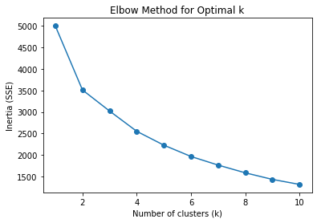
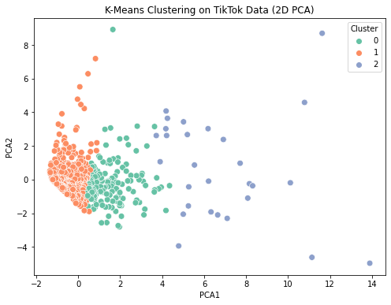

```python
# Importing libraries to be used.
import pandas as pd
import numpy as np
import matplotlib.pyplot as plt
import seaborn as sns
from sklearn.cluster import KMeans
from sklearn.preprocessing import StandardScaler
from sklearn.decomposition import PCA

#  Loading the dataset
df = pd.read_csv("socialMedia_Influencers_TiktokSep2022.csv")

print(df.head())
print(df.info())


```

       S.no   Tiktoker name   Tiktok name Subscribers Views avg. Likes avg.  \
    0     1   jypestraykids    Stray Kids       13.8M       6.4M       2.3M   
    1     2      khaby.lame  Khabane lame      149.2M      17.3M       2.3M   
    2     3  scarlettsspam2      scarlett        2.1M      17.9M     845.8K   
    3     4       addisonre   Addison Rae       88.7M        22M     906.6K   
    4     5      belindatok       Belinda        4.8M      14.2M       1.5M   
    
      Comments avg. Shares avg.  
    0         50.2K       34.2K  
    1         15.2K        8.7K  
    2         53.9K        6.3K  
    3          7.6K       26.2K  
    4         14.5K       15.3K  
    <class 'pandas.core.frame.DataFrame'>
    RangeIndex: 1000 entries, 0 to 999
    Data columns (total 8 columns):
     #   Column         Non-Null Count  Dtype 
    ---  ------         --------------  ----- 
     0   S.no           1000 non-null   int64 
     1   Tiktoker name  1000 non-null   object
     2   Tiktok name    999 non-null    object
     3   Subscribers    1000 non-null   object
     4   Views avg.     1000 non-null   object
     5   Likes avg.     1000 non-null   object
     6   Comments avg.  1000 non-null   object
     7   Shares avg.    1000 non-null   object
    dtypes: int64(1), object(7)
    memory usage: 62.6+ KB
    None


```python
# Helper function to convert values like '13.8M', '50.2K' into numbers
def convert_to_number(x):
    if isinstance(x, str):
        x = x.replace(",", "").strip()
        if x.endswith("K"):
            return float(x[:-1]) * 1_000
        elif x.endswith("M"):
            return float(x[:-1]) * 1_000_000
        elif x.endswith("B"):
            return float(x[:-1]) * 1_000_000_000
        else:
            return float(x)
    return x

# Apply conversion to selected columns
num_cols = ["Subscribers", "Views avg.", "Likes avg.", "Comments avg.", "Shares avg."]
for col in num_cols:
    df[col] = df[col].apply(convert_to_number)

print(df[num_cols].head())
print(df.dtypes)
```

       Subscribers  Views avg.  Likes avg.  Comments avg.  Shares avg.
    0   13800000.0   6400000.0   2300000.0        50200.0      34200.0
    1  149200000.0  17300000.0   2300000.0        15200.0       8700.0
    2    2100000.0  17900000.0    845800.0        53900.0       6300.0
    3   88700000.0  22000000.0    906600.0         7600.0      26200.0
    4    4800000.0  14200000.0   1500000.0        14500.0      15300.0
    S.no               int64
    Tiktoker name     object
    Tiktok name       object
    Subscribers      float64
    Views avg.       float64
    Likes avg.       float64
    Comments avg.    float64
    Shares avg.      float64
    dtype: object


```python
# Selecting numerical features for clustering
features = num_cols
X = df[features]

```


```python
# Standardizing the features
scaler = StandardScaler()
X_scaled = scaler.fit_transform(X)

```


```python

# using Elbow method
inertia = []
K = range(1, 11)
for k in K:
    km = KMeans(n_clusters=k, random_state=42, n_init=10)
    km.fit(X_scaled)
    inertia.append(km.inertia_)

plt.plot(K, inertia, marker='o')
plt.xlabel("Number of clusters (k)")
plt.ylabel("Inertia (SSE)")
plt.title("Elbow Method for Optimal k")
plt.show()
```


    

    


```python
# Training KMeans with chosen k 
kmeans = KMeans(n_clusters=3, random_state=42, n_init=10)
df['Cluster'] = kmeans.fit_predict(X_scaled)

```


```python

# PCA visualization by clustering K-means
pca = PCA(n_components=2)
pca_result = pca.fit_transform(X_scaled)
df['PCA1'] = pca_result[:,0]
df['PCA2'] = pca_result[:,1]

plt.figure(figsize=(8,6))
sns.scatterplot(x='PCA1', y='PCA2', hue='Cluster', data=df, palette='Set2', s=60)
plt.title("K-Means Clustering on TikTok Data (2D PCA)")
plt.show()
```


    

    


```python

# Inspecting the  cluster characteristics
print(df.groupby('Cluster')[features].mean())
```

              Subscribers    Views avg.    Likes avg.  Comments avg.   Shares avg.
    Cluster                                                                       
    0        1.363303e+07  5.167665e+06  6.404108e+05    3572.365269   3827.215569
    1        4.774087e+06  2.105505e+06  2.562955e+05    1851.980124   2911.600000
    2        3.441987e+07  1.059286e+07  1.398857e+06   16167.857143  10017.857143


```python

```


```python

```
